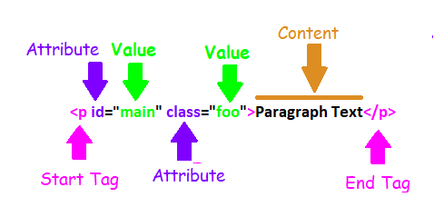

### Terms

__HTML__  - Hypertext Markup Language
* __Hypertext__ - Text displayed on electronic devices with references to other text that a reader can immediately access.
* __Markup Language__ - Uses tags to define the elements in the document.

#### Basic Elements

__Tags Opening and Closing HTML Tags Example__

__\<head\>__ - Container for other head elements.
* __\<title\>__ (required element)
* __\<style\>__
* __\<base\>__
* __\<link\>__
* __\<meta\>__
* __\<script\>__
* __\<noscript\>__

__\<body\>__ - Container for other elements whose content is to be rendered on the screen.
* __\<h1\> - \<h6\>__ (heading elements)
* __\<p\>__ (paragraph element)
* ...

